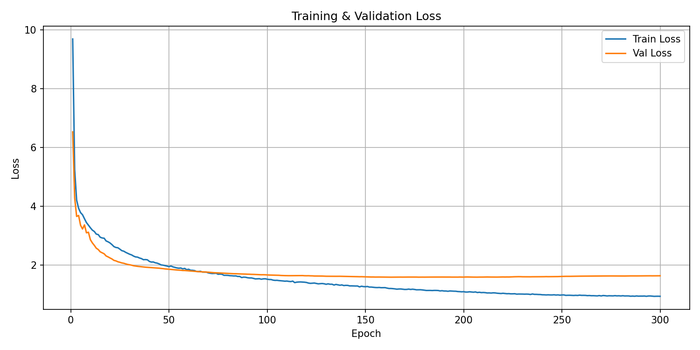
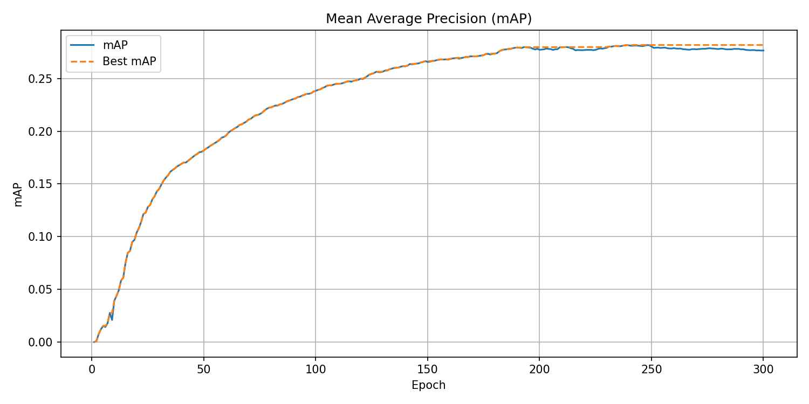
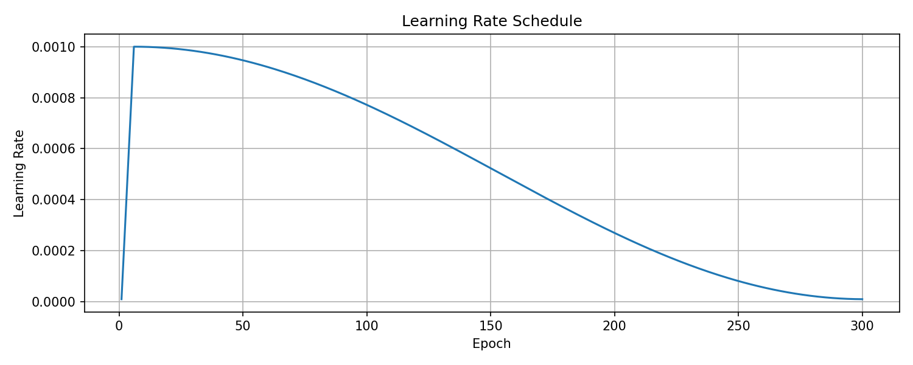
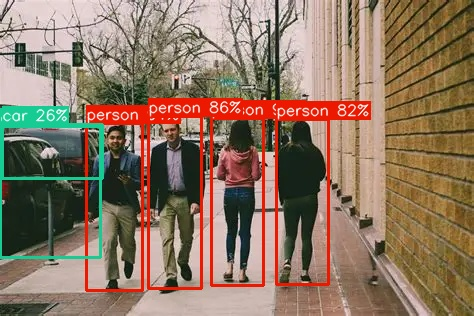

# YOLO-X

A custom implementation of YOLO-X object detection model in PyTorch.

## Training

The model was trained on the **Pascal VOC** dataset for **300 epochs**.

### Training & Validation Loss



### Mean Average Precision (mAP)



### Learning Rate Schedule



## Results

| Metric | Value |
|--------|-------|
| Best mAP | 0.2819 |
| Final Train Loss | 0.934 |
| Final Val Loss | 1.632 |
| Total Epochs | 300 |

## Inference



```bash
#  usage
python infer.py path/to/image.jpg

```

## Hyperparameters

| Parameter | Value |
|-----------|-------|
| Input Size | 640×640 (letterboxed) |
| Batch Size | 16 |
| Optimizer | AdamW |
| Learning Rate | 0.001 |
| Weight Decay | 5e-4 |
| Scheduler | Linear Warmup → Cosine Annealing |
| Warmup Epochs | 5 |
| Warmup LR Factor | 0.01 |
| Min LR | 1e-5 |
| EMA Decay | 0.9999 |
| Mixed Precision | (AMP + GradScaler) |
| Num Workers | 4 (train) / 2 (val) |

### Data Augmentations (Train)

| Augmentation | Config |
|-------------|--------|
| HorizontalFlip | p=0.5 |
| Affine (scale) | 0.5–1.5, p=0.5 |
| Affine (translate) | ±10%, p=0.5 |
| HueSaturationValue | H±20, S±30, V±30, p=0.5 |
| RandomBrightnessContrast | ±0.2, p=0.5 |

## TODO

- [ ] Hyperparameter tuning
  - [ ] Experiment with higher learning rates (e.g. 0.01, 0.005)
  - [ ] Try SGD with momentum as an alternative to AdamW
  - [ ] Test larger batch sizes (32, 64)
  - [ ] Tune weight decay (1e-4, 1e-3)
  - [ ] Adjust warmup epochs and cosine annealing schedule
  - [ ] Try different augmentation strengths (Mosaic, MixUp)
- [ ] Re-run training with best hyperparameters
- [ ] Re-evaluate on MS COCO dataset and update results

## License

This project is licensed under the [GNU Affero General Public License v3.0 (AGPL-3.0)](LICENSE) - see the [LICENSE](LICENSE) file for details.
